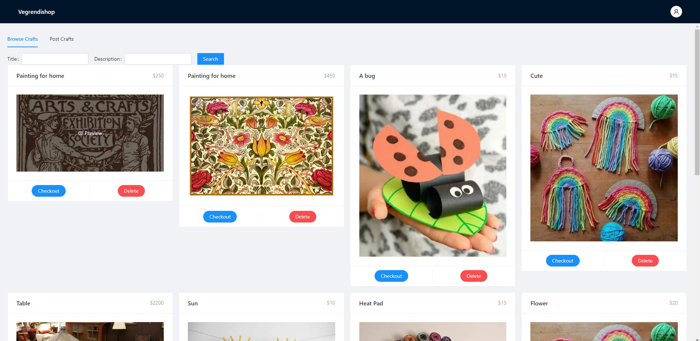
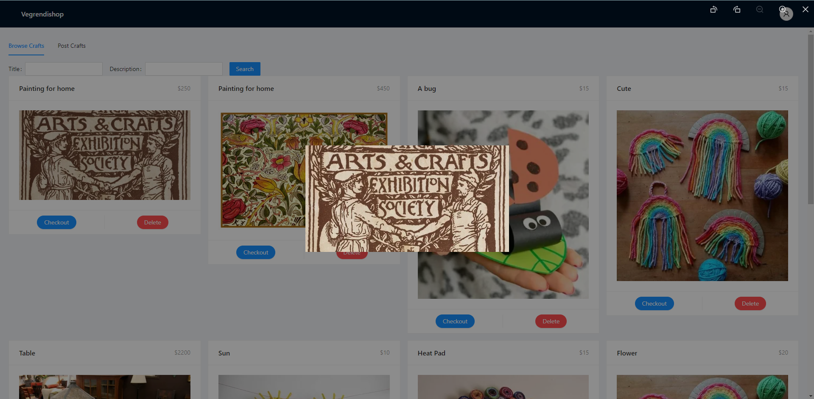
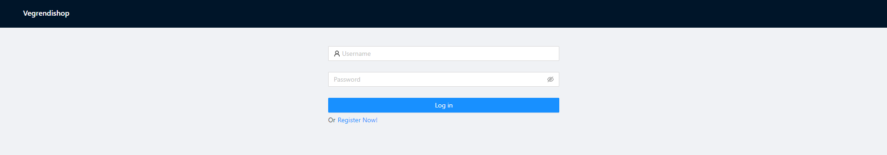
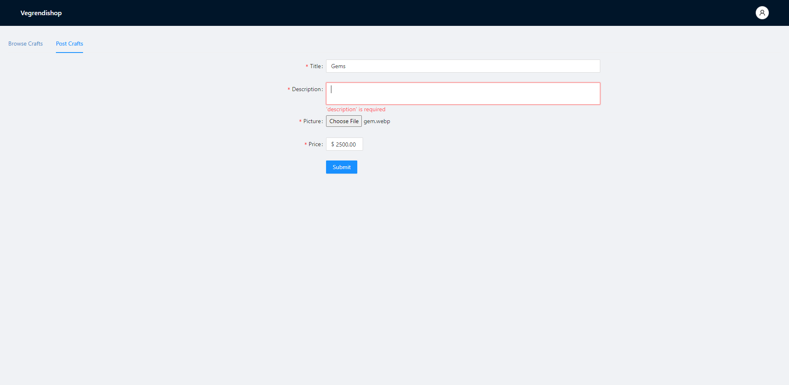
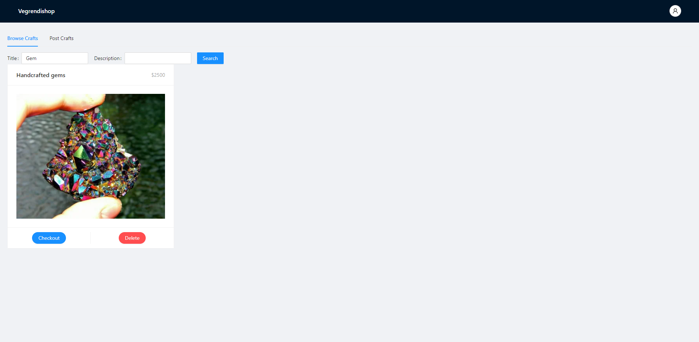
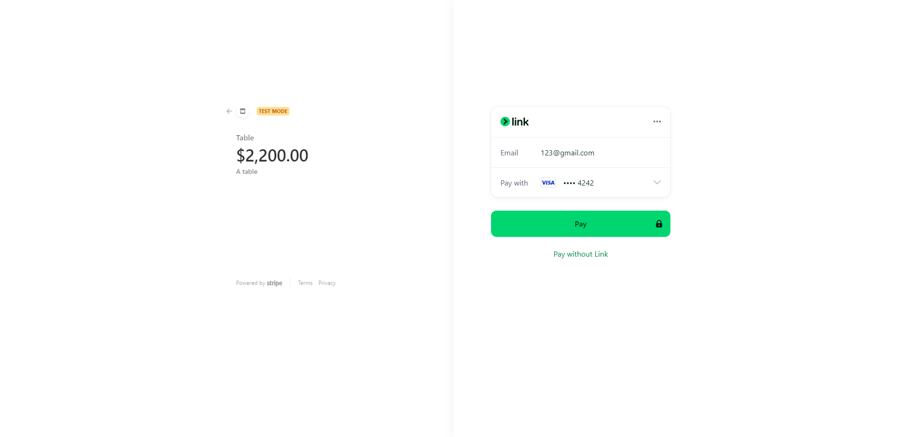

# Vegrendishop

This project is a online retail shop that allows small businesses to create and sell their styled apps.

The client adopted React and Ant Design for an engaging and intuitive user experience. The HTTP requests and responses are handled by gorilla handlers, and secured by jwt middleware. Data is stored in a go ElasticSearch noSQL database and integrated with GCP bucket for image storage.

## Demonstration

This is the home page of the application. Each user can search for apps that they are interested in using their title and description.

The users can also click on each craft posting to see a more detailed image of the craft:

Users have the options to register and login for better user experience and functions, like uploading:

Here is what the upload page looks like for registered users. Users are required to fill the necessary fields:

You can see the uploaded craft posting by searching it with its title (and description). You also have the ability to delete any of your postings:

If anyone is interested in purchasing any of the crafts, they can simply click on the checkout button under each posting to securely checkout with Stripe:

